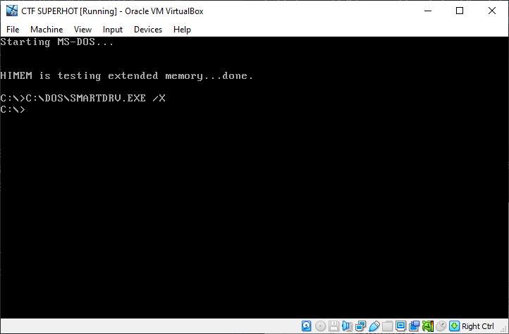

# UIUCTF - SUPER (18 solves)

> HOT
Hint 1: Forensics integrity is important... unless you like corrupted binaries
Hint 2: The file is encrypted with a repeating XOR cipher

**Category**: forensics

**Given**: 
- [SUPERHOT](handouts/SUPERHOT): A binary file

**Requirements**: Python, [VirtualBox]

**Solution Files**: [decrypt.py](decrypt.py)

### Overview
The challenge title & description does not hint to much, which is one reason I didn't bother tackling this challenge until I read the hints, which was released a bit later. Primarily, hint 2 is what got me started on this challenge. 

### Basic recon
Typically, when giving a random file like this, a few commands can tell us a lot. Lets try `file` & `binwalk`:

```sh
$ file SUPERHOT
SUPERHOT: data

$ binwalk -e SUPERHOT
DECIMAL       HEXADECIMAL     DESCRIPTION
--------------------------------------------------------------------------------
8419201       0x807781        MPFS filesystem, Microchop, version 42.79, 21333 file entries
```

Hmm, there seems to be nothing of interest in the file. Searching up MPFS filesystem yielded [this Wikipedia article](https://en.wikipedia.org/wiki/Multi_Path_File_System), and [this StackOverflow question](https://stackoverflow.com/questions/16770784/how-to-extract-mpfs-filesystem) also pertaining to the output of `binwalk`. Now, it was time to dive into a hexdump of the file.

```sh
$ hexdump -e SUPERHOT | less
00000000  30 3a 3e 20 31 3c 26 2c  53 55 50 47 52 49 4f 54  |0:> 1<&,SUPGRIOT|
00000010  53 55 50 45 52 48 4d 54  7b 33 6c 67 24 2a 20 2c  |SUPERHMT{3lg$* ,|
00000020  53 53 50 44 05 21 7d 3f  53 55 50 45 d2 48 4f 54  |SSPD.!}?SUPE.HOT|
00000030  53 55 50 45 d2 48 4f 54  43 14 40 7a 52 48 4f 57  |SUPE.HOTC.@zRHOW|
00000040  ac aa be ae 4e d4 b1 24  44 a2 3e 0b da 7f bd bc  |....N..$D.>.....|
00000050  b6 10 55 0d 52 48 4f 54  53 55 50 45 52 48 4f 54  |..U.RHOTSUPERHOT|
00000060  53 55 50 45 52 48 4f 54  53 55 50 45 52 48 4f 54  |SUPERHOTSUPERHOT|
...
```

Huh, that's a lot of "SUPERHOT"s that definitely do not belong in a regular file. This could indicate the usage of an XOR cipher, with the key likely being `SUPERHOT`.

> At this point while competing, I decoded the file using hint 2 (which clearly states that the file is encrypted using an XOR cipher). However, after the CTF, I learned more about the properties of an XOR cipher, one of which is that the character XORed by itself is equal to a null byte. Many file types typically have lots of null bytes, so the repeated presence of SUPERHOT should've been an obvious clue that the file was encrypted with an XOR cipher.

### Decrypting the file
Decrypting the file with knowledge about the key and the cipher is quite simple. I borrowed some code from a CTF writeup I found while learning about XOR ciphers (I can't find the source, sorry :cry:), which IMO was written quite elegantly.

```python
from itertools import cycle

with open('handouts/SUPERHOT', 'rb') as f:
    data = f.read()

data_numbers = list(data)  # Converts bytes to list of ints


def decrypt(c_num, k_num):
    return bytearray([c ^ k for c, k in zip(c_num, cycle(k_num))])

def decode():
    key = b'SUPERHOT'
    key_numbers = list(key)
    print(key_numbers)

    with open('handouts/decrypted.bin', 'wb') as f:
        f.write(decrypt(data_numbers, key_numbers))

    print('done')

decode()
```

Basically, the code decrypts each byte in the file, using the 8-byte key (`SUPERHOT`) repeatedly (hence the [`cycle`](https://docs.python.org/3/library/itertools.html#itertools.cycle) function). Now, we can investigate the decrypted file.

### Analyzing the decrypted file
Same old `file` & `binwalk`:

```sh
$ file decrypted.bin
decrypted.bin: Microsoft Disk Image, Virtual Server or Virtual PC

$ binwalk -e decrypted.bin

DECIMAL       HEXADECIMAL     DESCRIPTION
--------------------------------------------------------------------------------
319268        0x4DF24         Ubiquiti firmware header, third party, ~CRC32: 0x45584520, version: "EXE "
388697        0x5EE59         Copyright string: "Copyright 1981-1994 Microsoft Corp Licensed Material - Property of Microsoft All rights reserved NUL"
489920        0x779C0         Copyright string: "Copyright Microsoft Corp 1981-1994."
531888        0x81DB0         Copyright string: "Copyright 1981-1994 Microsoft Corp Licensed Material - Property of Microsoft All rights reserved "
556927        0x87F7F         Copyright string: "Copyright (c) 1"
639191        0x9C0D7         Copyright string: "Copyright 1981-1994 Microsoft Corp Licensed Material - Property of Microsoft All rights reserved "
889320        0xD91E8         Copyright string: "Copyright (c) 19"
1104412       0x10DA1C        Copyright string: "Copyright 1981-1994 Microsoft Corp Licensed Material - Property of Microsoft All rights reserved "
1450924       0x1623AC        Copyright string: "Copyright 1981-1994 Microsoft Corp Licensed Material - Property of Microsoft All rights reserved u"
1825884       0x1BDC5C        Copyright string: "Copyright 1981-1994 Microsoft Corp Licensed Material - Property of Microsoft All rights reserved u"
1841023       0x1C177F        Copyright string: "Copyright 1981-1994 Microsoft Corp Licensed Material - Property of Microsoft All rights reserved u"
1961536       0x1DEE40        Copyright string: "Copyright 1992 by Symantec Corporation"
2238967       0x2229F7        Copyright string: "Copyright Microsoft Corporation 1986, 1994"
2258585       0x227699        Unix path: /07/9104/25/9105/05/9106/01/92
2302924       0x2323CC        Copyright string: "Copyright MICROSOFT Corp., 1990"
2364700       0x24151C        Boot section Start 0x3C End 0x0
2364704       0x241520        Boot section Start 0x0 End 0x0
2435508       0x2529B4        Unix path: /E/K/S/V] [/D:<driver> ... ] [/L:<letter>] [/M:<buffers>]
...
9144030       0x8B86DE        Copyright string: "Copyright (c) 1988 Borland Intl."
```

What the heck? `file` seems to indicate that the file is actually some sort of bootable disk. `binwalk` outputs many old Microsoft copyright strings, as well as references to boot sectors. Clearly, this is some sort of bootable image. But what kind? It is doubtful that a 10 megabyte file could contain a modern Windows installation, so I did more digging in the decrypted file. Running `strings` on the file and `grep`ing "Microsoft", I found this in the last line:

```sh
$ strings decrypted.bin | grep -i microsoft
...
Microsoft(R) MS-DOS(R) Version 6.22
             (C)Copyright Microsoft Corp 1981-1994.
$$$$$$$$$$$$$$$$$$$$$$$$$$$$$$$$$$$$$$$$$$$$$$$$$$$$$$$$$$$$$$$$$MS DOS Version 6 (C)Copyright 1981-1994 Microsoft Corp Licensed Material - Property of Microsoft All rights reserved
```

Hmm, is this MS-DOS? I looked up [a list of Windows versions](https://en.wikipedia.org/wiki/List_of_Microsoft_Windows_versions) and compared the dates with the copyright headers. Okay, probably not MS-DOS, but something like that. Anyways, I needed to find a way to boot or at least mount the disk.

### Booting from the disk file
Originally, I tried to open the disk image as an `.iso`. Well, that didn't work out (errored with `The disc image file is corrupted`). Since this was a disk image, I thought why not try to boot it? My first thought was using [DOSBox](https://www.dosbox.com). but I also couldn't figure out how to load the disk image (it may not even be possible?). Although my go-to virtualization software is VMWare, I used [VirtualBox] since the `hexdump` of the disk image mentioned "vbox" in the beginning:

```sh
$ hexdump -C decrypted.bin | less
00000000  63 6f 6e 65 63 74 69 78  00 00 00 02 00 01 00 00  |conectix........|
00000010  00 00 00 00 00 00 02 00  28 66 3c 22 76 62 6f 78  |........(f<"vbox|
00000020  00 06 00 01 57 69 32 6b  00 00 00 00 80 00 00 00  |....Wi2k........|
...
```

Loading and booting the disk image wasn't too hard in VirtualBox. I selected the oldest version of Windows available in the dropdown box.

<p float="left">


</p>

Wow! We managed to boot into DOS with the disk image.

### Digging through the filesystem
Let's browse around with some [basic DOS commands][DOS Commands].

```bat
C:\>dir

 Volume in drive C is MS-DOS_6
 Volume Serial Number is ____-____
 Directory of C:\

DOS          <DIR>         07-30-99   1:30p
COMMAND  COM        54,645 05-31-94   6:22a
WINA20   386         9,349 05-31-94   6:22a
CONFIG   SYS            71 07-30-99   1:30p
AUTOEXEC BAT            78 07-30-99   1:30p
LOG1     IRC         1,072 07-30-99   1:49p
SUPER        <DIR>         07-30-99   1:37p
        7 file(s)         65,215 bytes
                   2,133,688,320 bytes free
```

At this point, I started by `cd`-ing into the `SUPER` directory, which ended up just being a deeply nested mess of SUPER\HOT\SUPER\HOT\..., with an empty HOT directory at the end. Clearly something was still missing. Next, I took a look into the `LOG1.IRC` file, which clearly did not really belong (with an `.IRC` extension):

```bat
C:\>type LOG1.IRC
[13:33] *** Joins: white (whitehoodhacker@sigpwny)
[13:33] <white> Dude, you should play SUPERHOT, it's the most innovative game I've played in years!
[13:33] <white> I'll send it to your file server
[13:35] <someradgamer> epic I'll check it out
[13:38] <someradgamer> why does the setup create so many folders?
[13:38] <someradgamer> I have to change directories so many times to reach superhot.exe
[13:39] <white> Have you tried it yet?
[13:40] <someradgamer> yeah, it's just some dumb title screen, how do I play?
[13:40] <white> That *is* the game
[13:40] <white> you just keep repeating the title
[13:45] <white> oh I almost forgot to mention
[13:46] <white> there's a bug where if you SUPERHOT too much, it will SUPERHOT your entire PC
[13:47] <someradgamer> wait what
[13:48] <someradgamer> that doesn't sound HOT
[13:48] <someradgamer> I'm SUPER deleting this now
[13:48] <someradgamer> what the HOT is happening to my SUPER computer!?
[13:48] <SUPERHOT> SUPERHOT SUPERHOT SUPERHOT
[SU:PE] <RHOT> SUPERHOT SUPERHOT SU
```

Ah, it makes sense why the deeply nested folders led to an empty directory. The previous user had deleted the file. I started searching for ways to recover files in DOS, like the recycle bin that is present in modern versions of Windows. Thankfully, there was actually a similar command present in DOS, which I found while scrolling through the [DOS command reference][DOS Commands]: [undelete](https://www.computerhope.com/undelete.htm). Hoping for the best, I ran the command:

```bat
C:\SUPER\HOT\SUPER\HOT\SUPER\HOT\SUPER\HOT\SUPER\HOT>undelete

UNDELETE - A delete protection facility
Copyright (C) 1987-1993 Central Point Software, Inc.
All rights reserved.

Directory: C:\SUPER\HOT\SUPER\HOT\SUPER\HOT\SUPER\HOT\SUPER\HOT
File Specifications: *.*

    Delete Sentry control file not found.

    Deletion-tracking file not found.

    MS-DOS directory contains    1 deleted files.
    Of those,    1 files may be recovered.

Using the MS-DOS directory method.

      ?UPERHOT EXE    16013  7-30-99  1:37p  ...A  Undelete (Y/N)? Y
      Please type the first character for ?UPERHOT.EXE: S

File successfully undeleted.
```

### Running the executable

Hooray! We now have an executable named `SUPERHOT.EXE` that we are clearly meant to run.

```bat
C:\SUPER\HOT\SUPER\HOT\SUPER\HOT\SUPER\HOT\SUPER\HOT>SUPERHOT.EXE

```

Wait what? Why did my DOS prompt freeze? I had no idea, so I forcefully shut down the VM, re-decrypted the original SUPERHOT file, and booted the VM from that fresh disk image file. Since I now knew how to recover the executable, I simply `cd`ed all the way and ran `undelete` again. This time, the executable ran:

```bat
C:\SUPER\HOT\SUPER\HOT\SUPER\HOT\SUPER\HOT\SUPER\HOT>SUPERHOT.EXE
SUPER

>
```

The executable takes an input, but when I tried typing a random string:

```bat
SUPER

> blahblah
FINISH IT.

> SUPER
FINISH IT.
```

I was clearly missing something. What does it want me to finish? I then promptly realized what it was asking for:

```bat
SUPER

> HOT
uiuctf{R3sT0re_f0R_M0re}

C:\SUPER\HOT\SUPER\HOT\SUPER\HOT\SUPER\HOT\SUPER\HOT>
```

There we have it!

> Note: I later learned from the [challenge author](https://github.com/WhiteHoodHacker) why the executable froze the VM. When I ran some of the `dir` commands, it wrote something to disk and corrupted the undeleted file. Hence, the first hint about corrupted binaries. I explored this afterwards by intentionally running dir commands before viewing the bianry with `type`, and it was obvious that the outputs of `dir` overwrote some parts of the `SUPERHOT.EXE` binary.


**Flag**: uiuctf{R3sT0re_f0R_M0re}

[VirtualBox]: https://www.virtualbox.org
[DOS Commands]: https://www.computerhope.com/overview.htm