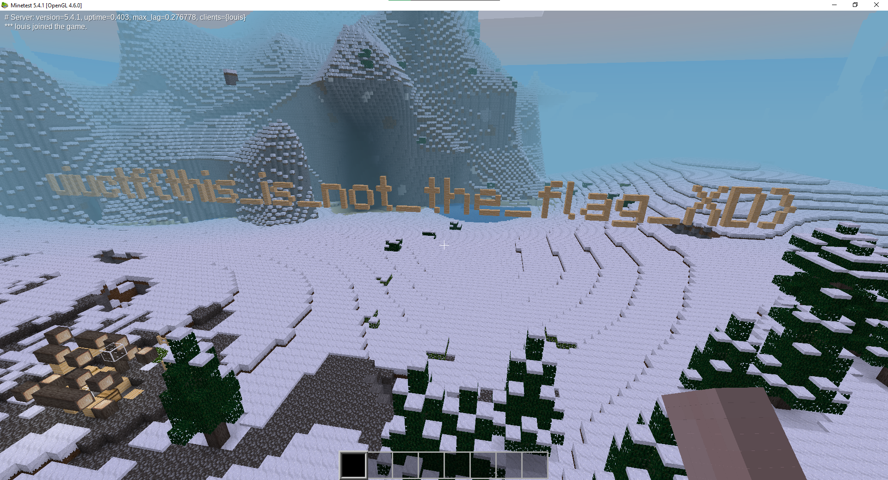
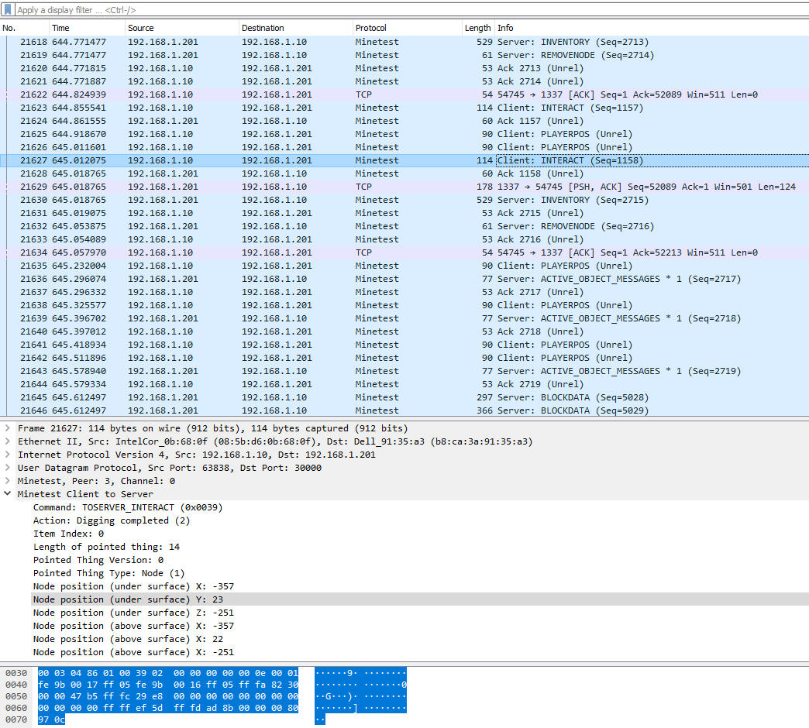
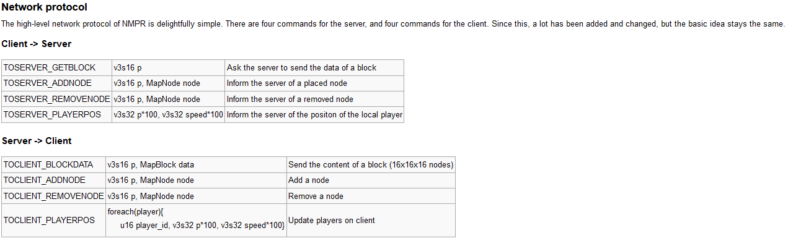

# UIUCTF - toobeetootee (7 solves)

> Oh no! the infamous popbob hacked into my Minetest server, griefed my house, and tampered with the flag! Luckily, I was running a network capture at the time. Can you help me rollback the damage?

**Category**: forensics
**Given**: 
- [toobeetootee.pcap](handouts/toobeetootee.pcap): packet capture (henceforth referred to as "pcap") file between server & client
- [world.zip](handouts/world.zip): The Minetest world on the server

**Requirements**: Python, [pyshark](https://github.com/KimiNewt/pyshark), [Minetest](https://www.minetest.net), [Wireshark](https://www.wireshark.org)
**Solution Files**: [parse.py](parse.py), [revertchanges/init.lua](revertchanges/init.lua), [revertchanges/mod.conf](revertchanges/mod.conf)
**TL;DR**: Parse packets, find block place & break events, undo changes with Minetest mod.

### Overview
The challenge, named after [the oldest anarchy server in Minecraft](https://www.youtube.com/watch?v=jCio1MtgORQ), involves a packet capture and a Minetest world. The core gameplay of Minetest involves placing & breaking blocks — hence, it is most likely that the flag is encoded in block form as well. As the hint suggests, we need to undo changes done to the game world. Once we boot up Minetest, unzip the world into a worlds directory, we see that this is the case:



> Note: To give yourself full permissions in-game, type `/grantme all`. Press the `K` key to fly.

### Plan
My main goal was to automate the parsing of the pcap, which should yield a list of changes made to the world. Then, using [Minetest's native mod support](https://dev.minetest.net/Modding_Intro), write a Lua mod to go through the list and revert the changes.

### Analyzing the pcap
To be able to understand the pcap, I started digging through the [Minetest source code](https://github.com/minetest/minetest/tree/master) to see what Minetest packets look like. The first thing that caught my eye was a [packet dissector](https://github.com/minetest/minetest/blob/master/util/wireshark/minetest.lua) for the Minetest protocol, which was a Wireshark plugin that could be dropped in the `plugins` directory. This was a great find, since this meant that I didn't have to actually parse the raw data myself. I opened the `.pcap` file with Wireshark and voilà, the dissector did half the job:



The Minetest dev wiki explains [some of these commands](https://dev.minetest.net/Engine/NMPR#Network_protocol):



But wait, the wiki page only lists 8 commands! A lot of the other commands like `PLAYERPOS` & `INTERACT` aren't explained. However, the `Action` field of the `INTERACT` command makes the packet's purpose fairly self-explanatory. I revisited the [source code](https://github.com/minetest/minetest/blob/63fc728a84a5ba97240233ad1c5d94f1ade2deb1/src/network/networkprotocol.h#L1058-L1066) to confirm my understanding:

```cpp
enum InteractAction : u8
{
	INTERACT_START_DIGGING,     // 0: start digging (from undersurface) or use
	INTERACT_STOP_DIGGING,      // 1: stop digging (all parameters ignored)
	INTERACT_DIGGING_COMPLETED, // 2: digging completed
	INTERACT_PLACE,             // 3: place block or item (to abovesurface)
	INTERACT_USE,               // 4: use item
	INTERACT_ACTIVATE           // 5: rightclick air ("activate")
};
```

At this point, I was thinking that handling packets with the command `TOSERVER_INTERACT` may be enough, since it handles both the breaking (`INTERACT_DIGGING_COMPLETED`) & placing (`INTERACT_PLACE`) of blocks. Although this was ultimately the case, I did worry about the potential scenario where explosives were used (2b2t griefers :man_shrugging:), which would most likely mean that changes would be sent in chunks of block update packets. For now though, I ignored that possibility since the pcap didn't seem to show many split packets (Minetest seemed to split up certain packets into chunks if they were too long).

### Scripting the pcap parser
Thanks to the amazing pyshark package, I had an easy way to iterate through all the packets sequentially:

```python
capture: FileCapture = FileCapture('handouts/toobeetootee.pcap')

current_packet: Packet = capture.next()
i = 0
try:
    while current_packet is not None:
        print(i)
        handle(current_packet)
        current_packet = capture.next()
        i += 1
except StopIteration:
    print('Done!')
```

I was not too familiar with the library, so I did a bit of reading (aka reading the pyshark [README examples](https://github.com/KimiNewt/pyshark/blob/master/README.md#reading-from-a-capture-file) :sweat_smile:). From that, I saw that each packet object consisted of layers, each of which corresponded to a row in the Wireshark packet details pane:

`[<ETH Layer>, <IP Layer>, <UDP Layer>, <DATA Layer>, <MINETEST Layer>, <DATA Layer>, <MINETEST.SERVER Layer>]`

A bit of REPL later (very valuable tool for prototyping btw), I managed to extract the command from each Minetest packet:

```python
last_layer: Layer = packet.layers[-1]
if last_layer.layer_name == 'minetest.server':
    command: int = last_layer.command.hex_value
    if (cb := command_handlers.get(command, None)) is not None:
        cb(last_layer)
elif last_layer.layer_name == 'minetest.client':
    command: int = last_layer.command.hex_value
    if (cb := command_handlers.get(command, None)) is not None:
        cb(last_layer)
elif last_layer.layer_name == 'minetest.control':
    pass
elif last_layer.layer_name == 'minetest.split':
    pass
else:
    print(last_layer.layer_name)
```

Not the cleanest code, but it works :smile:. Now, I could handle the `TOSERVER_CLIENT` packets and ignore the rest. More REPLing led to this:

```python
def interact_handler(layer: Layer):
    #print(layer._all_fields)
    action: int = layer.interact_action.int_value

    if action == 5:
        return

    try:
        under_x = int(layer.interact_pointed_under_x)
        under_y = int(layer.interact_pointed_under_y)
        under_z = int(layer.interact_pointed_under_z)
        above_x = int(layer.interact_pointed_above_x.fields[0].show)
        above_y = int(layer.interact_pointed_above_x.fields[1].show)
        above_z = int(layer.interact_pointed_above_x.fields[2].show)
        if action == START_DIGGING:
            pass
            # print(f'Started digging ({x}, {y}, {z})')
        elif action == STOP_DIGGING:
            pass
            # print(f'Stopped digging ({x}, {y}, {z})')
        elif action == COMPLETE_DIGGING:
            # print(f'Completed digging ({x}, {y}, {z})')
            all_events.insert(0, f'{{ x={under_x}, y={under_y}, z={under_z}, event="place" }}')
        elif action == INTERACT_PLACE:
            # print(f'Placed block ({x}, {y}, {z})')
            all_events.insert(0, f'{{ x={above_x}, y={above_y}, z={above_z}, event="break" }}')
    except AttributeError:
        print(layer._all_fields)
```

A few things to note here:
- For `TOSERVER_INTERACT` packets, there were usually two positions: under & above. However, the Minetest packet dissector grouped the above position into one field, which is why the list indexing is needed to extract the actual above coordinates.
- Thanks to [Minetest comments](https://github.com/minetest/minetest/blob/a106bfd456509b676ccba0ac9bef75c214819028/src/network/serverpackethandler.cpp#L1028-L1037), I learned that for block digging (aka breaking), the under position was used. For block placing, the above position was used instead. I failed to realize this at the start. which resulted in an incomplete restoration of the flag blocks.
- If the packet indicated that the client completed digging, I recorded a block being placed, and vice versa. This is because the goal is to revert the changes made to the world.

Running the parsing script gave me a massive Lua table (array/list in other languages) of the steps needed to revert the changes, which I used later in the mod:

```lua
{
  { x=-357, y=20, z=-264, event="break" },
  { x=-357, y=19, z=-264, event="break" },
  { x=-357, y=19, z=-263, event="place" },
  ...
  { x=-402, y=14, z=-190, event="place" }
}
```

I was able to verify that these coordinates look reasonable by going into Minetest and turning on debug mode (which shows the player's coordinates) with the `F5` key.

### Making the Minetest mod
Having absolutely no knowledge of knowing how to make a Minetest mod, I was very glad to find Minetest developer [rubenwardy](https://rubenwardy.com)'s [Minetest Modding Book](https://rubenwardy.com/minetest_modding_book/en/index.html). My prior experience with making Minecraft mods told me that registering a in-game command to trigger a piece of code was probably the easiest way to revert the changes to the map. I quickly skimmed through the book (mostly [commands](https://rubenwardy.com/minetest_modding_book/en/players/chat.html#chat-commands) & [setting blocks](https://rubenwardy.com/minetest_modding_book/en/map/environment.html#writing)) to get a quick prototype.

```lua
events = {
  { x=-357, y=20, z=-264, event="break" },
  { x=-357, y=19, z=-264, event="break" },
  { x=-357, y=19, z=-263, event="place" },
  ...
  { x=-402, y=14, z=-190, event="place" }
}

minetest.register_chatcommand("runit", {
	description = "Run the stuff",
	params = "<nickname>",
	privs = {},
	func = function(name, param)
		local target = minetest.get_player_by_name(name)
		minetest.chat_send_all("Hi "..name)

        for i, event in ipairs(events) do
            local pos = { x = event["x"], y = event["y"], z = event["z"] }
            local at_pos = minetest.get_node(pos)
            if event["event"] == "break" then
                if at_pos["name"] ~= "default:pine_wood" then
                    minetest.chat_send_all("trying to break air!")
                end
                minetest.set_node(pos, { name = "air" })
            elseif event["event"] == "place" then
                if at_pos["name"] == "default:pine_wood" then
                    minetest.chat_send_all("trying to overwrite!")
                end
                minetest.set_node(pos, { name = "default:pine_wood" })
            end
        end
	end
})
```

To truly verify the coordinates were actually correct, I added some debug code to check if the code was trying to place a block where there was already one, or break a block that didn't exist. This is where I realized the different between under & above positions as mentioned previously. I also made another command that incrementally reverted changes, one by one, as a way to make sure the process worked.

And now, the moment of truth!


**Flag**: uiuctf{BudG3t_c4ves_N_cl1fFs}
